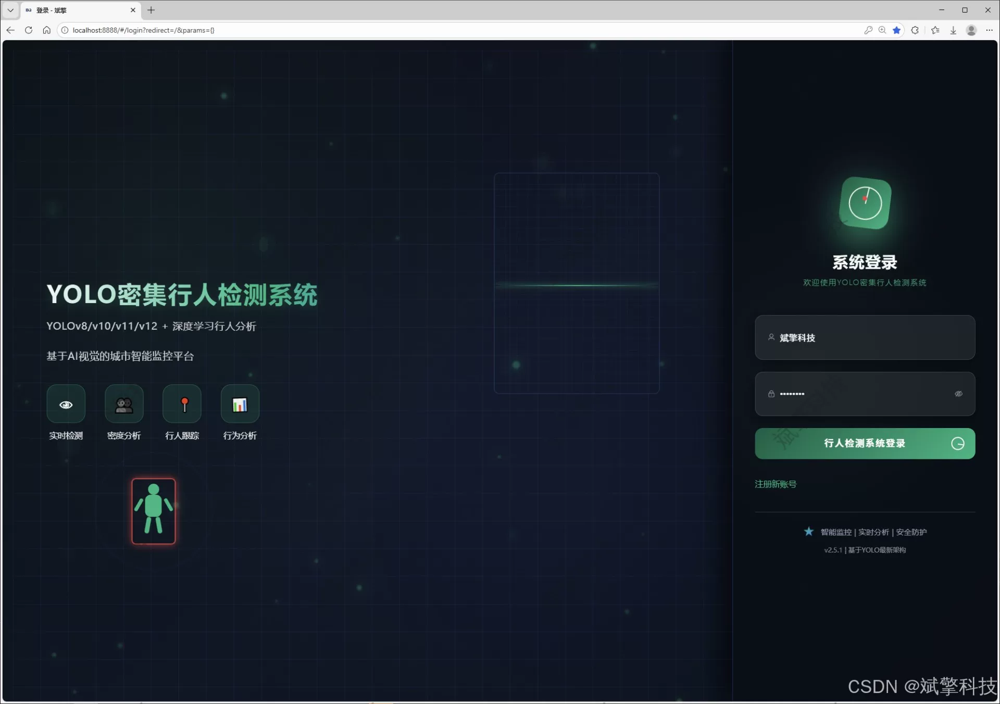
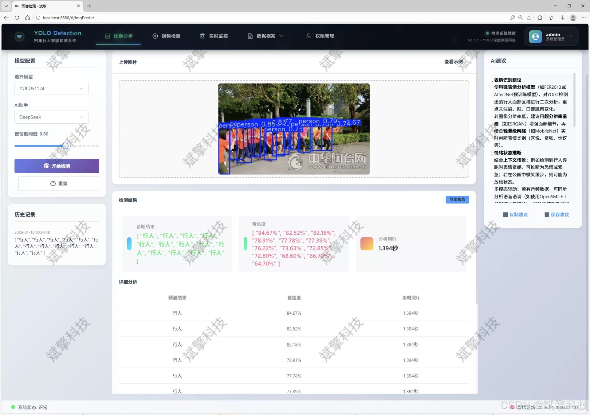
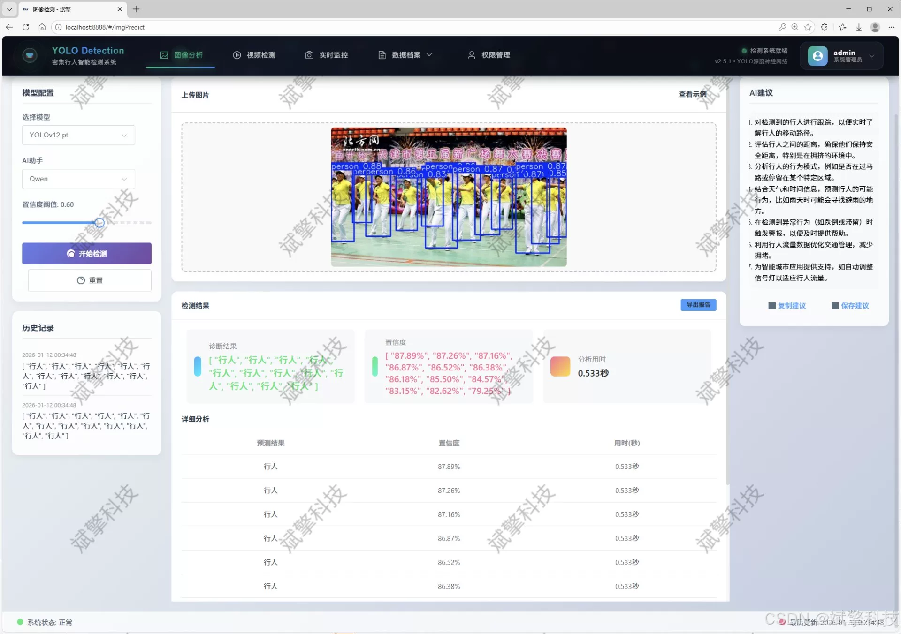
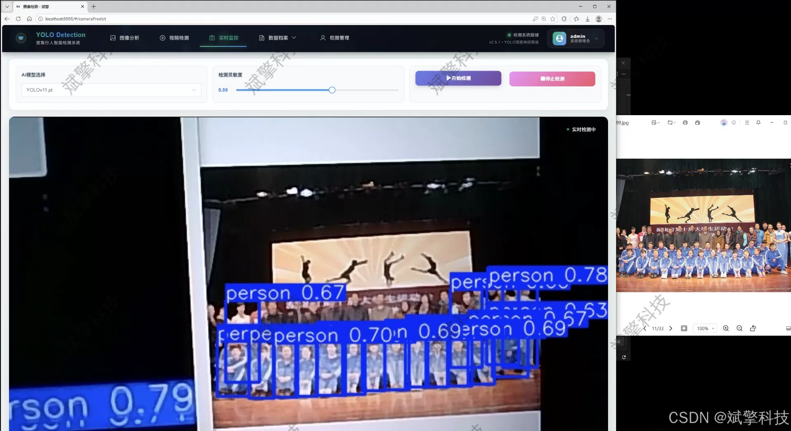
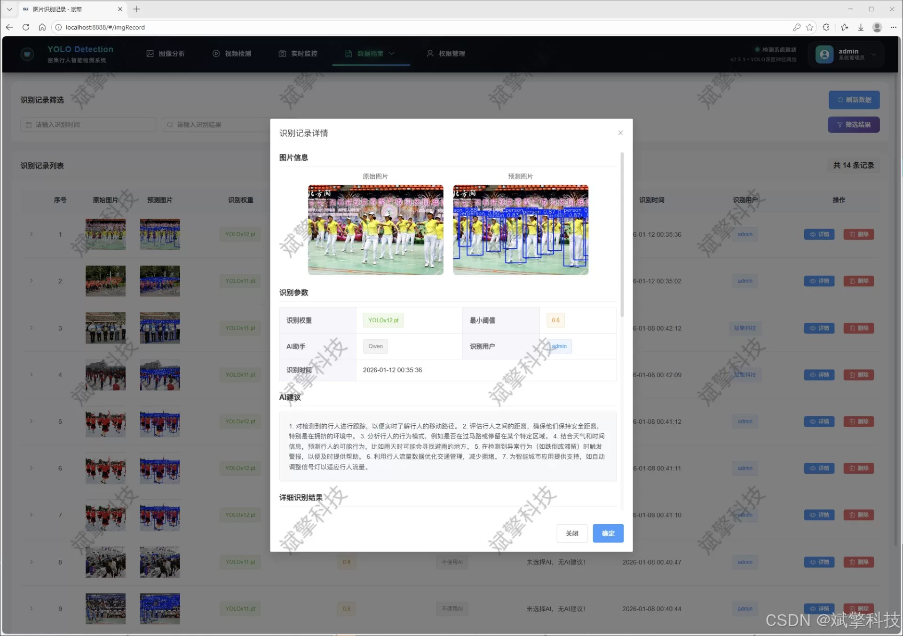
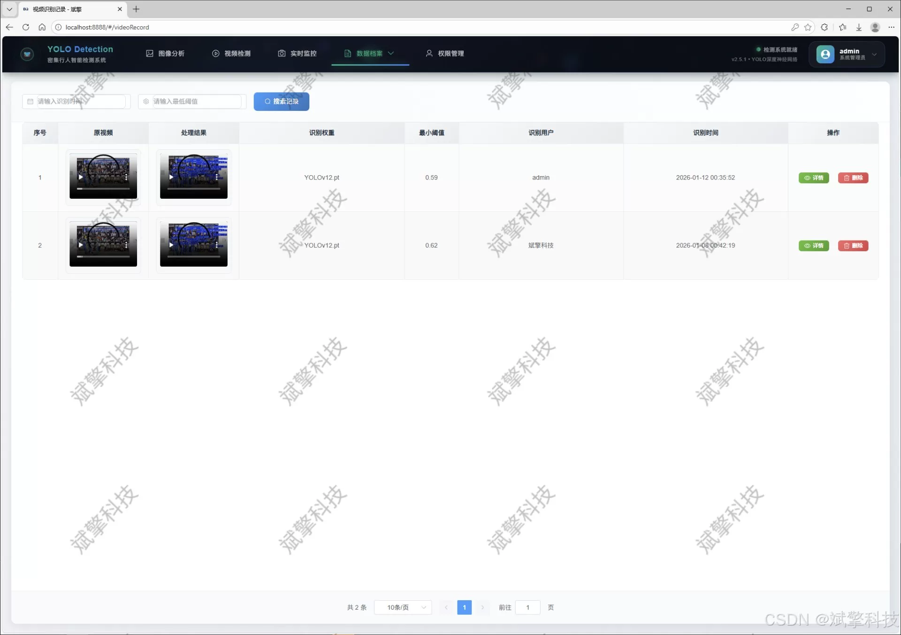
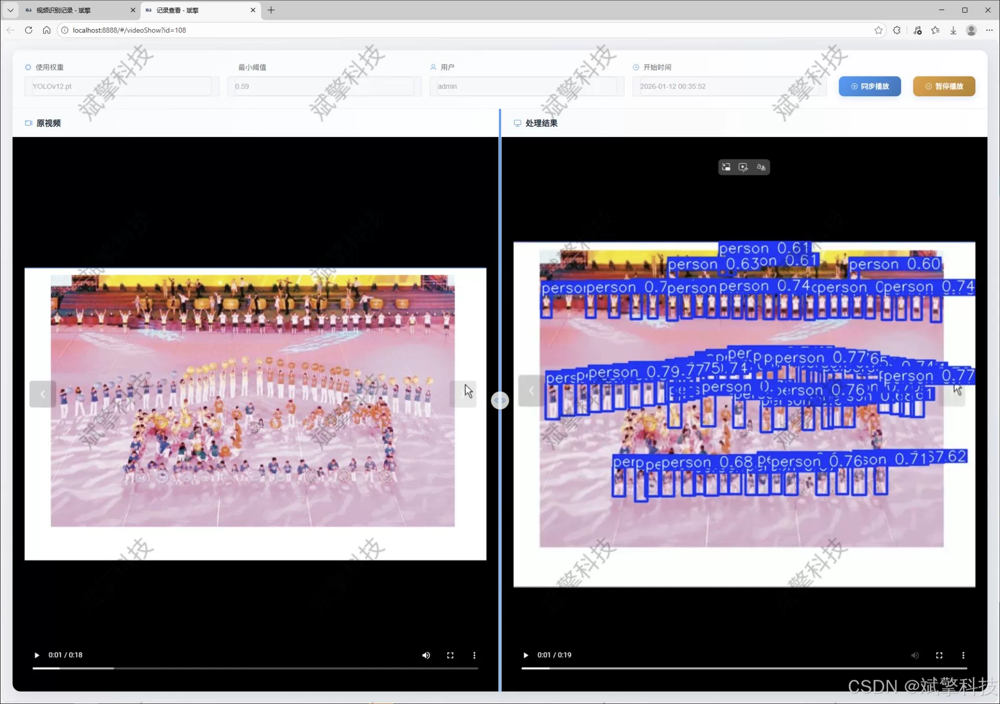
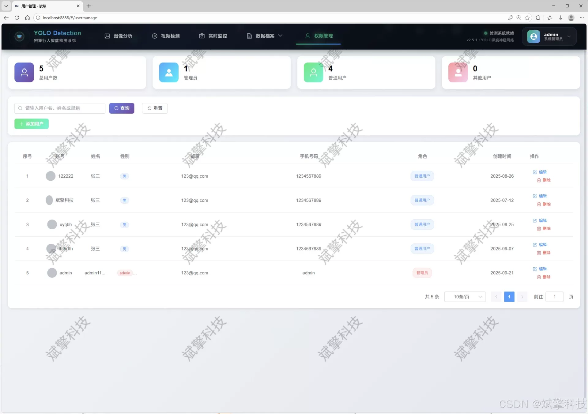
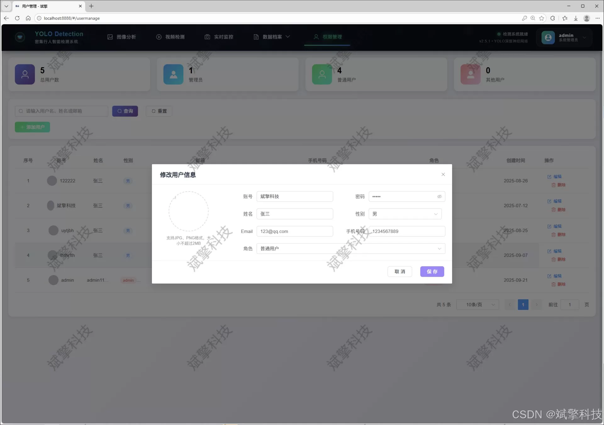

# Based on YOLO deep learning and the large models of Qianwen and DeepSeek, dense pedestrians

## Body

Based on YOLO deep learning and the large models of Qianwen, DeepSeek dense pedestrian detection system (DeepSeek intelligent analysis + web interface + front-end separation + YOLO data + YOLOv8/YOLOv10/YOLOv11/YOLOv12)

With the acceleration of urbanization and the increasing demand for public safety, efficient and accurate dense pedestrian detection technology has become a core requirement in smart security, intelligent transportation, passenger flow statistics, and other fields. Addressing the issues of low accuracy and poor real-time performance in traditional detection methods under complex scenarios, this study designed and implemented an integrated dense pedestrian detection and intelligent analysis system that integrates cutting-edge deep learning object detection models with modern Web technologies. The system is centered around the outstanding YOLO series models (including v8, v10, v11, v12 versions), constructing a detection framework that supports flexible model switching and comparison. The system's backend is built using SpringBoot to implement RESTful API; the frontend uses modern frameworks such as Vue.js to form a front-end-back-end separation architecture, ensuring system maintainability and scalability.

The system integrates the intelligent analysis function of the DeepSeek large language model, capable of providing semantic descriptions and deep interpretations of detection results. The database is selected for MySQL, used for persistent storage of user information, detection records, and result data. The system features comprehensive functions, supporting pedestrian detection from image and video files as well as real-time streams from cameras, along with a complete user authentication and management system. The system was trained and validated on a dedicated "pedestrian" category dataset containing 9,000 images (7,200 training set and 1,800 validation set). This ensures the model's robustness in real-world dense scenarios. Practical experience demonstrates that the system provides a powerful, user-friendly, and efficient platform, offering reliable technical support for smart city management and related industry applications.

Functional modules

✅ User login registration: Supports password verification and saves to MySQL database.

✅ Supports four YOLO models switches, YOLOv8, YOLOv10, YOLOv11, YOLOv12.

✅ Information visualization, data visualization.

✅ Pedestrian detection supported by AI analysis, deepseek and Qianwen.

✅ Supports image detection, video detection, and real-time camera detection, with detection results saved to MySQL database.

✅ Image recognition record management, video recognition record management, and camera recognition record management.

✅ User management module, allowing administrators to add, delete, update, and view users.

✅ Personal center, where users can modify their information, including passwords, names, and profile pictures.

## Images

## Payment

Here is a pay link on Stripe ( https://buy.stripe.com/3cs8yP7sY87d0vu9AB ). Please contact me lonlonago@foxmail.com after funding $89, and I will send you a complete data files , thank you!

